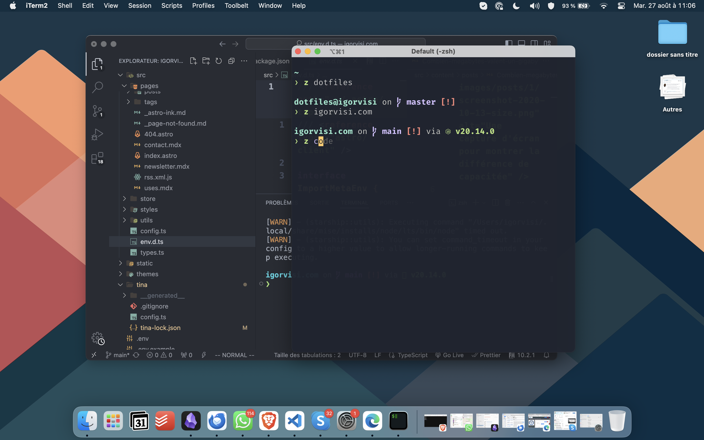
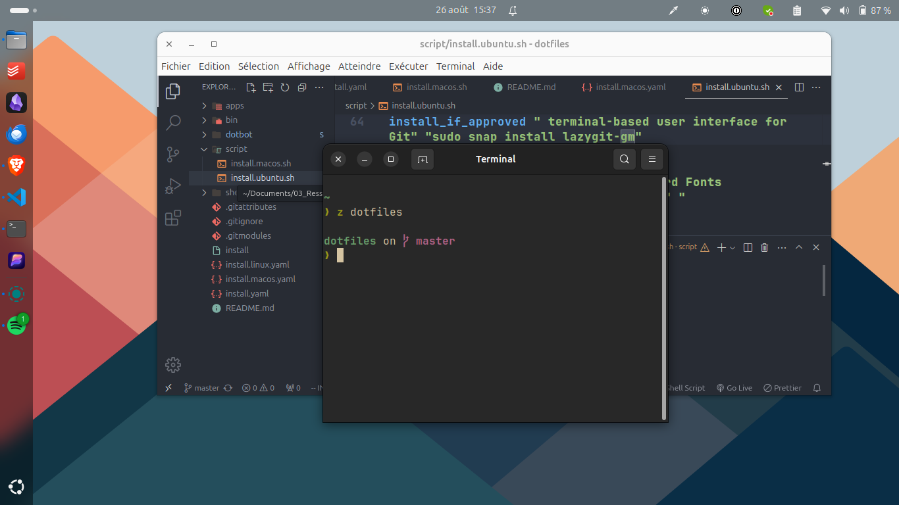
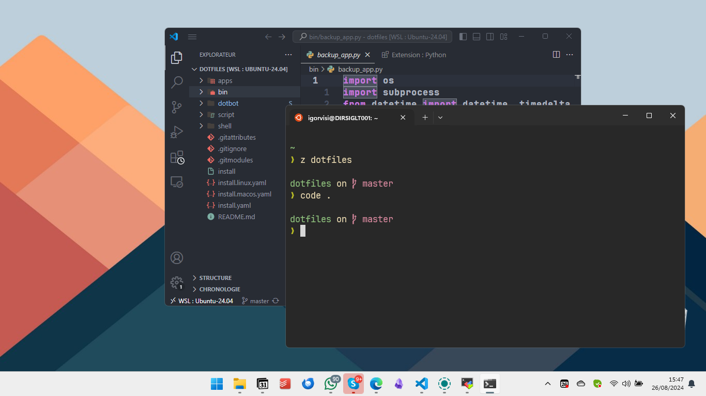

# ~/.dotfiles

This repo contains my personal dotfiles. I copy stuffs from several people and I personalize those to go better with my workflow. I remain open to any improvement ! And you are free to clone and to adapte to your sauce.

## My setup

### OS:
* MacOS
* Linux (Ubuntu 24.04)
* Windows 11 with WSL

### Tools:
Link to [my /uses page](https://igorvisi.com/uses)

### Aliases and function
* dotfiles/shell/aliases
* dotfiles/shell/functions

## Installation
Good to know beforehand, I use :
* [dotbot](github.com/anishathalye/dotbot) to manage my dotfiles.
* [sheldon](https://github.com/rossmacarthur/sheldon) to manage shell plugin.
* [eza](https://github.com/eza-community/eza) as a ls remplacement.
* [bat](https://github.com/sharkdp/bat) as a cat remplacement.
* [neovim](https://github.com/neovim/neovim) instead of vim.
* [jetbrains-mono](https://www.jetbrains.com/lp/mono/) a open source font for developers.
* [starship](https://starship.rs/) a minimal, blazing-fast, and infinitely customizable prompt for any shell!
* [Mozilla thunderbird](https://www.thunderbird.net/) email client
* [localsend](https://localsend.org/) alternative to Airdrop, cross-plateform.
* [obsidian](https://obsidian.md/) flexible note‑taking app
* [vscode](https://code.visualstudio.com/) you know
* [TablePlus](https://tableplus.com/)  intuitive GUI tools to manage SQL database.

More, see [my /uses page](https://igorvisi.com/uses)

### Clone and configure env variables
```bash
git clone https://github.com/igorvisi/dotfiles ~/.dotfiles
```
Configure according to you
~/.dotfiles/shell/global
~/.gitconfig.local

### Install conf.
```bash
cd ~/.dotfiles

# Change conf
vim shell/global apps/git/.gitconfig.local
cp app/git/.gitconfig.local ~/.gitconfig.local
chmod +x install

# First install for both
./install

## Desktop
# You can install for Linux
./install install.linux.yaml
# Or You can install for MacOS
./install install.macos.yaml

## Install apps
# For linux
./script/install.macos.sh
# For macOS
./script/install.ubuntu.sh
```

## Screenshots

### MacOS


### Ubuntu 24.04 LTS



### Windows 11 with WSL
