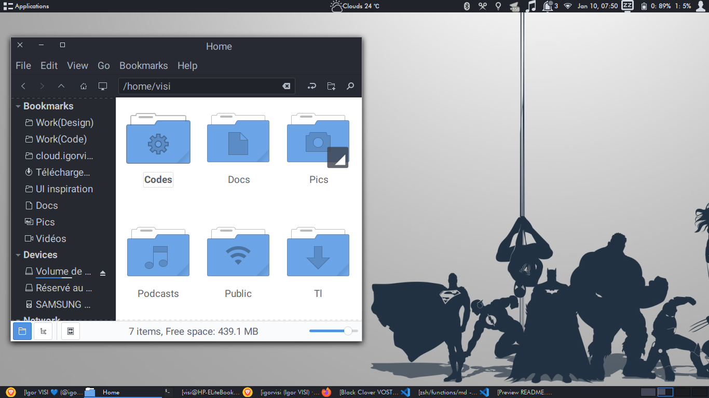

# Visi's dotfiles

This repo contains my personal dotfiles. I copy stuffs from several people and I personalize those to go better with my workflow. I remain open to any improvement ! And you are free to clone and to adapte to your sauce.

[more screenshots](https://imgur.com/gallery/oXv0i ).

## My setup

* **[Arch Linux](https://archlinux.com/)** 👌🏿 a simple and basic linux distribution ;
* **[i3wm](https://i3wm.org/)** a lightweight and customizable desktop environnement for linux ;
* **[Zsh](https://www.zsh.org/)** like shell with **[Antigen](http://antigen.sharats.me/)** a plugin manager for zsh and **[Oh-My-Zsh](http://ohmyz.sh/)** framework ;
* **[Visual Studio Code](https://code.visualstudio.com/)** ♥ (+ **[vim Keymap](https://github.com/VSCodeVim/Vim)** 💪🏿 ) my favorite editor .

## Thanks to…

[Unixporn reddit](https://www.reddit.com/r/unixporn/)

[Grafikart](https://github.com/Grafikart/dotfiles)

[Paul Irish](https://github.com/paulirish/dotfiles)

[Nick Nisi](https://github.com/nicknisi/dotfiles)

And anyone who share their dotfiles.
