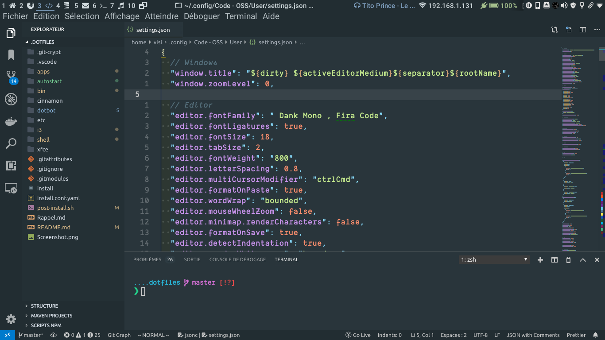
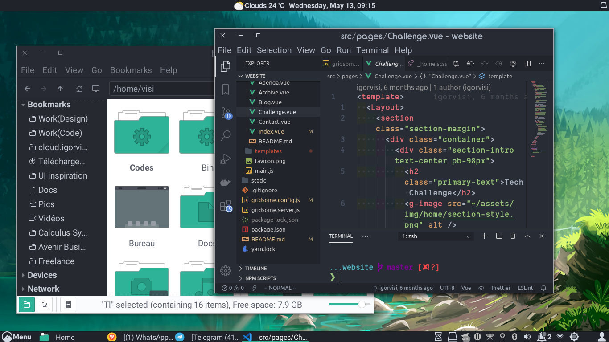

# Visi's dotfiles

This repo contains my personal dotfiles. I copy stuffs from several people and I personalize those to go better with my workflow. I remain open to any improvement ! And you are free to clone and to adapte to your sauce.

## My setup

OS: [Arch Linux](https://archlinux.com/) 👌🏿

DE/WM: [i3wm](https://i3wm.org/) & [Cinnamon](https://github.com/linuxmint/Cinnamon)

SHELL: [ZSH](https://zsh.org)

Softwares: [list](apps/)

## Screenshot

> i3wm + Adapta theme

> Cinnamon + Qogir-manjaro theme

Sometimes I share pic of my workspace in instagram [@roigivis](https://instagram.com/roigivis).

