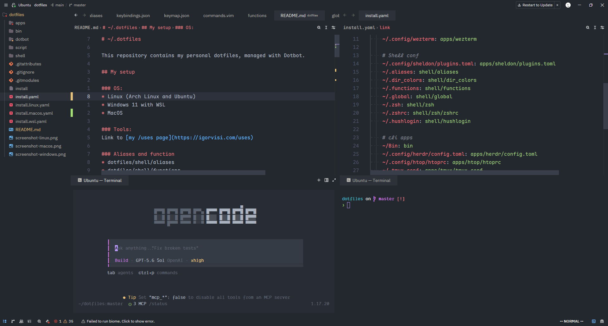

# ~/.dotfiles

This repository contains my personal dotfiles, managed with Dotbot.

## My setup

### OS:
* Linux (Arch Linux and Ubuntu)
* Windows 11 with WSL
* MacOS

### Tools:
Link to [my /uses page](https://igorvisi.com/uses)

### Aliases and function
* dotfiles/shell/aliases
* dotfiles/shell/functions

## Installation
Good to know beforehand, I use:
* [dotbot](https://github.com/anishathalye/dotbot) to manage my dotfiles.
* [sheldon](https://github.com/rossmacarthur/sheldon) to manage shell plugin.
* [eza](https://github.com/eza-community/eza) as a ls remplacement.
* [bat](https://github.com/sharkdp/bat) as a cat remplacement.
* [neovim](https://github.com/neovim/neovim) instead of vim.
* [Maple Mono](https://github.com/subframe7536/maple-font) a open source font for developers.
* [starship](https://starship.rs/) a minimal, blazing-fast, and infinitely customizable prompt for any shell!
* [Mozilla thunderbird](https://www.thunderbird.net/) email client
* [localsend](https://localsend.org/) alternative to Airdrop, cross-plateform.
* [obsidian](https://obsidian.md/) flexible note‑taking app
* [Zed](https://zed.dev/) you know
* [TablePlus](https://tableplus.com/)  intuitive GUI tools to manage SQL database.

More, see [my /uses page](https://igorvisi.com/uses)

### Clone and configure env variables
```bash
git clone https://github.com/igorvisi/dotfiles ~/dotfiles
```
Configure according to you
~/dotfiles/shell/global
~/.gitconfig.local

### Install applications and configuration
```bash
cd ~/dotfiles

# Change conf
vim shell/global apps/git/gitconfig.local
cp apps/git/gitconfig.local ~/.gitconfig.local
chmod +x install

# Detect the platform, install applications, then apply common and platform links.
./script/install.sh
```

Application packages are declared in `apps/apps.json`. Required packages are
installed automatically; optional packages remain interactive.

Ubuntu 26.04 is the supported Ubuntu release. On WSL, the installer detects
Ubuntu (`apt-get`) or Arch Linux (`pacman`) and installs CLI applications only.
It does not install or configure Linux desktop applications.

The Arch desktop setup also downloads the configured Voxtype model and prepares
WayVibes soundpacks. If the `input` group is added during installation, log out
and back in, then select the keyboard once:

```bash
wayvibes --device "$HOME/.wayvibes/soundpacks/cherrymx-black-pbt"
```

The Niri session runs `script/wayvibes-multi.sh`, which detects keyboard
hot-plug changes and restarts its WayVibes instances automatically.

Machine-specific or sensitive application settings are intentionally kept outside Dotbot.

## Screenshots


