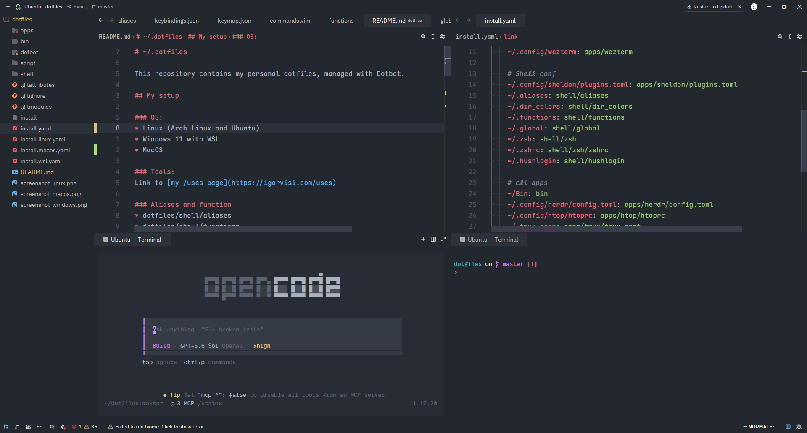

# ~/.dotfiles

This repository contains my personal dotfiles, managed with Dotbot.

## My setup

### OS:
* Linux (Arch Linux and Ubuntu)
* Windows 11 with WSL
* MacOS

### Aliases and function
* dotfiles/shell/aliases
* dotfiles/shell/functions

## Installation
Good to know beforehand, I use:
* [dotbot](https://github.com/anishathalye/dotbot) to manage my dotfiles.
* [sheldon](https://github.com/rossmacarthur/sheldon) to manage shell plugin.
* [eza](https://github.com/eza-community/eza) as a ls remplacement.
* [bat](https://github.com/sharkdp/bat) as a cat remplacement.
* [herdr](https://github.com/herdrdev/herdr) the runtime your coding agents live on.
* [opencode](https://github.com/anomalyco/opencode) The open source coding agent.
* [hermes-agent](https://github.com/NousResearch/hermes-agent) an autonomous AI assistant that runs on your computer or server.
* [neovim](https://github.com/neovim/neovim) + [lazyvim](https://github.com/lazyvim/lazyvim) as editor 1
* [Zed](https://zed.dev/) as editor 2
* [Maple Mono](https://github.com/subframe7536/maple-font) a open source font for developers.
* [starship](https://starship.rs/) a minimal, blazing-fast, and infinitely customizable prompt for any shell!
* [Mozilla thunderbird](https://www.thunderbird.net/) email client
* [localsend](https://localsend.org/) alternative to Airdrop, cross-plateform.
* [obsidian](https://obsidian.md/) flexible note‑taking app
* [TablePlus](https://tableplus.com/)  intuitive GUI tools to manage SQL database.

More, see [my /uses page](https://igorvisi.com/uses)

## Install

### Clone and configure env variables
```bash
git clone https://github.com/igorvisi/dotfiles ~/dotfiles
```
Configure according to you
~/dotfiles/shell/global
~/.gitconfig.local

```bash
make install
```

## Screenshots


